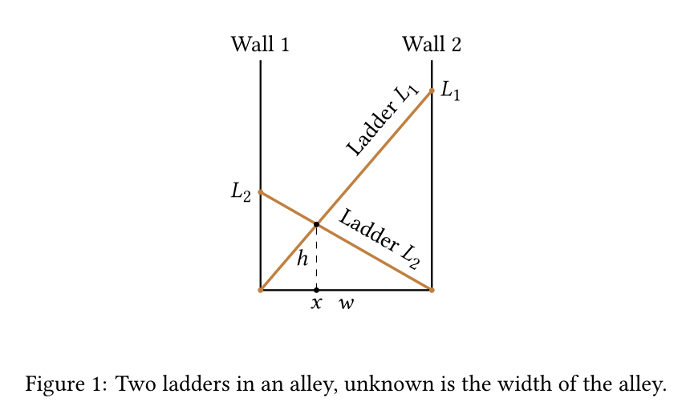

# Programming Assignment 1

## The Modified Two-Ladder Problem

Two buildings are separated by an alley. Two ladders are placed so that the base of each ladder is against one of the buildings and reaches the top of the other building. The two ladders are `L1 = 40 ft` and `L2 = 30 ft` long. They cross at a point `h = 10 ft` above the ground. How wide is the alley (find `w`)?

Diagram (not to scale):

Legend and coordinates:
- Left wall is at `x = 0`, ground at `y = 0`.
- Right wall is at `x = w`.
- Ladder `L1` runs from `(0,0)` to `(w, y1)` and has length `L1 = 40`.
- Ladder `L2` runs from `(w,0)` to `(0, y2)` and has length `L2 = 30`.
- The ladders cross at `(x, h)` where `h = 10`.
- Unknown: the alley width `w`.

(You may use these coordinates and lengths to set up the geometric equations to solve for `w`.)

## The approach you must follow

  * Derive an algebraic equation which `w` must satify (e.g., quadratic, cubic,
  quartic).
  
  * Implement a solver for algebraic equations of the type you derived,
  Covering linear, quadratic, cubic and quartic equations.

  * Your solver must not use iteration, but must use a solution
  in radicals. 
  
  * Create a test suite for the solve which will run by runnint `pytest`
  in the top folder of the repository.
  
## Startup code

  * Files <cubic_solver.py> and <quartic_solver.py> containing
  the signatures and rudimentary code for the tasks at hand.
  
  

